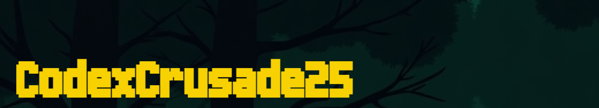

## Project Overview

CodexCrusade25 is an interactive web-based quiz and challenge game set in a dystopian future (Year 3012, Krasnoarsk, Kiev). Players embark on an epic quest as survivors, navigating perilous puzzles, answering critical questions, and mastering coding challenges to rebuild society. The fate of humanity lies in your hands!
##  Features

* **Immersive Premise:** An engaging introductory story sets the scene for your survival journey.

* **Multi-Stage Challenge:** Progress through distinct stages:

  * **Calavera (Aptitude):** Test your wits with logic and reasoning puzzles.

  * **Hades (Math):** Sharpen your numerical skills with mathematical challenges.

  * **Ragnarok (Programming):** Tackle coding problems to prove your technical prowess.

* **Dynamic Timer:** Each stage features a countdown timer, adding urgency to your mission.

* **Interactive Quizzes:** Multiple-choice questions and coding challenges keep you engaged.

* **Answer Saving:** Your answers can be downloaded for review (currently as HTML files).

* **Responsive Design:** Designed to be playable across various devices.

## 🎮 How to Play

1. **Clone the Repository:** git clone https://github.com/NauticalNerd95/CodexCrusade25.git
2. **Navigate to the Project Directory:** cd CodexCrusade25
3. **Open in Browser:**

* Simply open the `index.html` file in your preferred web browser.

* **Recommended:** For the best experience and to avoid potential local file restrictions, use a local development server (e.g., VS Code's Live Server extension, or Python's `http.server`).

* **Live Website:** You can also access the live version of the game here: [CodexCrusade25](https://NauticalNerd95.github.io/CodexCrusade25/)

## 🔑 Game Progression & Passwords

To advance from the Calavera stage to Hades, and from Hades to Ragnarok, you will need to enter a specific password.

* **Password for next stages:** `64925`

## 🛠️ Technologies Used

* **HTML5:** For structuring the web content.

* **CSS3:** For styling and visual presentation, including custom fonts and animations.

* **JavaScript:** For interactive elements, game logic, timers, and dynamic content.

## 🤝 Credits

Developed by NauticalNerd95(Shalom Salve).
